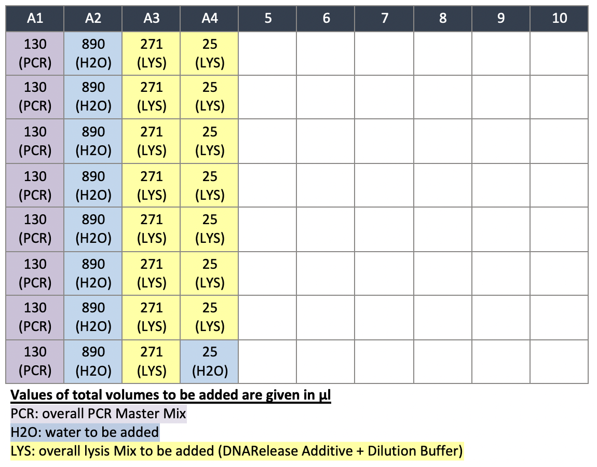

# Automating Sample Preparation and PCR-Genotyping of Mosquito Larvae

### Overview and pre-automation preparation
We have attempted to automate two key parts of a laborious mosquito genotyping protocol; larvae sample preparation, and multiplexed PCR.
Note that before running this code, the preparation of a 96-well plate already containing a single larva in each well is necessary.
  This includes the manual exclusion of larvae from the 'Dil' wells (B3, D6, and F9), by not placing larvae here.
  Unfortunately, the individual placement of live larvae into each well was not possible to automate in the timeframe of this project.
  The PCR of the lysed mosquito larvae uses three primers; two located in the wildtype and one located within the desired insert. These primers are included in the pre-made master mix made prior to the automation steps. The PCR can be considered multiplex due to it testing whether the insert is present in both, one, or neither allele. The presence of the insert will be indicative from larger bands present on agarose gel post-automated PCR cycle.

_The reservoirs must be carefully prepared as follows:_
- A1: overall Master Mix for the PCR step
- A2: water
- A3: overall mixed lysis buffer for the sample preparation step (DNARelease Additive + Dilution Buffer, 5µl/250µl, thoroughly mixed and vortexed)
- A4: same as A3, overall lysis buffer in the first 9 wells of the reservoir, except for the last well which has water just for the control (will be H12 in the PCR plate)

#### Overview of preparing the reservoir

Note that depending on the genotyping-specific PCR being carried out, the master mix composition in the A1 reservoir wells will have different primers.
The A1 Master Mix must also be prepared taking into account that for a 10µl PCR reaction volume. 
Instead of adding 0.25µl of the gDNA, 1ul (of a more dilute sample) will be added, so 0.75µl less water will be added in preparing the overall Master Mix. 

#### Overview of setting up the labware in the OT2 block layout

### How to use code
Run 'user_input.py' and you will be prompted with 2 automation options
- 1: Lysis + Dilution and PCR setup
- 2: PCR setup only

Afterwards, you will be prompted to enter PCR annealing temperature (Celsius) and extension time (seconds). 

Once that is done, a Python script (OT2_script.py) is generated for you to upload onto the OpenTron.

### Part 1: Larvae sample preparation (lysis step)
Brief description of what the code does:
- 20.5µl lysis buffer (from reservoir A3) is added to each well in the PCR 96-well rack (already in the thermocycler). Note that the tips aren't changed between adding the lysis buffer. As a p20 is being used, 20.5ul had to be divided, adding 10.25µl lysis buffer twice.
- The control well (H12) contains only water and no lysis buffer. This has been coded by using a different reservoir (A4) where the last well contains only water and the other wells contain lysis buffer.
- Thermocycler lid will automatically close and the heating for the sample prep (lysis) begins.

### Part 2: Multiplexed PCR for larvae genotyping
**Includes combined transfer step (transition from part 1 to part 2)**
- When the thermocycler is finished, the lid will open automatically and there will be a 'hold step', allowing you to take the post-lysis plate out, switch it with the plate in Block 1, and place the Block 1 plate in the thermocycler. 
- A p300 is used to add 61.5µl of water to each well (post-lysis) to dilute the samples 1 in 4, allowing for 1ul of the gDNA to be added in the PCR step.

**Setting up the PCR**
- The p20 is used to add 9µl of the overall PCR Master Mix (in reservoir A1) to each well of the newly switched PCR rack in the thermocycler. The same tip is used every time here, as just the Master Mix is being added.
- Then, changing the tip every time, the p20 is used to transfer 1µl of each sample of gDNA (from the Block 1 PCR rack), to the wells of the PCR rack in the thermocycler.
- Thermocycler lid will automatically close and the heating will start.
    - Denaturation temperature: 98 degrees C, 300s
    - PCR loop:
        - 98ºC, 5s
        - Annealing temperature (user input required), 5s
        - 72ºC, Extension time (user input required)
    - Final step: 72ºC, 60s

The thermocycler is programmed to run 40 cycles. Once the program finishes, the thermocycler will be held at 10ºC. The program will say "Resume to open thermocycler lid".

### If you want to run another PCR using the same gDNA samples
You need to ensure:
- Pipette tip boxes are refilled
- Block 1 contains the lysed gDNA sample plate
- The reservoir is carefully washed out (if you are doing a PCR with another set of primers) and refilled with respective Master Mixes, except for A3 and A4 which previously contained lysis buffer.
