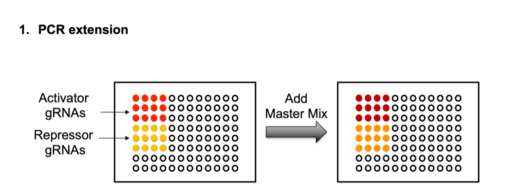
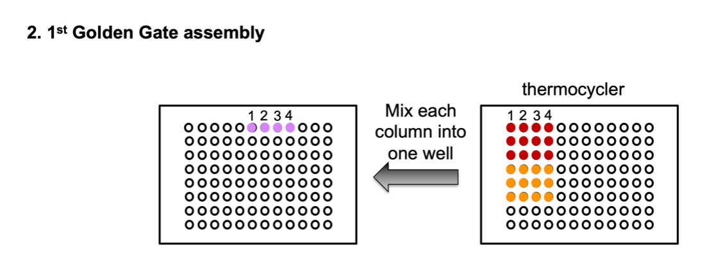
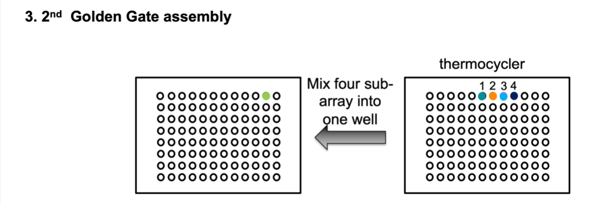

# Golden Gate Assembly of gRNA Expression Cassettes for CRISPR Multiplexing Protocol

## Overview
This Opentrons protocol automates the Golden Gate assembly of gRNA expression cassettes for CRISPR multiplexing. The protocol is designed to facilitate the generation of gRNA fragments using PCR and subsequent assembly processes. It accommodates multiple subarrays and manages precise temperature control for enzymatic reactions.

### Authors
- Hafsa Kaja Moinudeen
- Xinyu Zhuang
- Florence Heng
- Chenhao Yang
- Daimeng Yu
- Zhining Zhang

### Source
Automated protocol adapted from PMC9411621.

### Category
Synthetic Biology

### Created and Last Modified
- Created At: 2023-12-08
- Last Modified: 2023-12-10

## Protocol Steps

### gRNA Fragment Generation
This stage employs PCR to generate up to 24 gRNA fragments, encompassing both activation and repression types. Key steps include:
1. Addition of master mixes tailored for activation and repression gRNAs, with separate cycling for each.
2. A pause point post-PCR allows the user to purify the generated gRNA fragments through gel electrophoresis.

### Golden Gate Assembly
After PCR and the generation of double-stranded gRNA fragments, the protocol facilitates the Golden Gate assembly. This process is crucial for incorporating these fragments into a subarray vector, applicable when working with more than six gRNAs. This is followed by a pause in the protocol for transforming the assembled vectors into E. coli, followed by amplification and harvesting.

### Final Assembly
All subarrays are combined for insertion into the CRISPRai vector. This is achieved through another round of Golden Gate assembly.

### Pause Points
Throughout the protocol, there are designated pauses for essential manual interventions. These include PCR purification, transformation of vectors into E. coli, and colony picking.

## Equipment and Labware
- Pipettes: Single-channel P20 pipette
- Labware: 96-well plates, tip racks, thermal cycler module, temperature module, aluminium block
- Modules: Opentrons Thermocycler Module V2, Temperature Module Gen2

The labware should be set up like this:

## Instructions for Use

### Preparation
Ensure all master mixes are prepared and placed in the specified wells of the aluminium block. They can be loaded on in sequence as needed.
- Activation (dCas12a-VP) gRNA fragment PCR master mix – A6
- Repression (dCas9-Mxi1) gRNA fragment PCR master mix – B6
- Subarray plasmids 1 to 4 master mixes – C1 – C4
- CRISPRai vector master mix – D6

Below is an image showing the organisation of the source plate that is expected by opentron at the beginning of the protocol and after every pause step.

### Initialization
Modify the following variables as required in the script and load the protocol onto your Opentrons OT-2 robot.

#### Customization
- Modify the `num_of_arrays` variable to reflect the number of subarrays being processed.
- Configuring gRNA Wells: Modify the `activation_gRNA_wells` and `repression_gRNA_wells` variables according to your experiment's layout.

### Execution
Start the protocol. Manually intervene at pause points as required.
